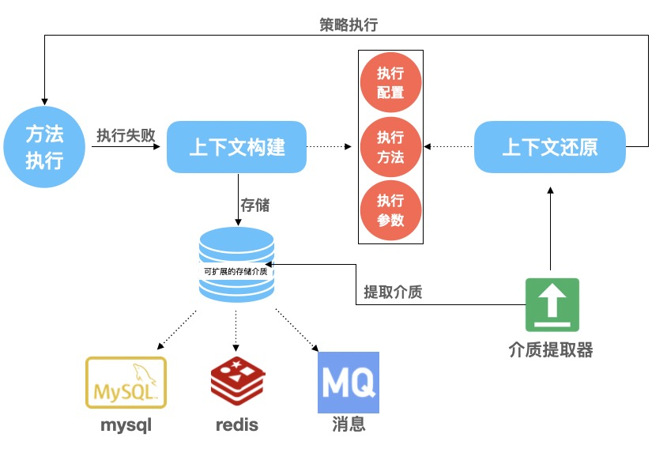

# Easy-Retry

一种存储介质可扩展的持久化重试方案


### Getting started

#### Memory Retry

1. 增加pom依赖

```xml
<dependency>
    <groupId>com.alibaba</groupId>
    <artifactId>easy-retry-memory-starter</artifactId>
    <version>${last-version}</version>
</dependency>
```

2. 在application.properties增加配置

`spring.easyretry.memory.enabled = true`

3. 在需要重试的方法上增加`@EasyRetryable`注解

```java
public class MemoryUserService {
    @EasyRetryable
    public User getUserById(Long userId){
        return new User();
    }
}
```

#### Mybatis Retry

1. 增加pom依赖
```xml
<dependency>
    <groupId>com.alibaba</groupId>
    <artifactId>easy-retry-mybatis-starter</artifactId>
    <version>${last-version}</version>
</dependency>
```

2. 在application.properties增加配置

`spring.easyretry.mybatis.enabled = true`

3. 声明`javax.sql.DataSource`的`Bean`实例，参考下面例子（以`druid`连接池为例）
```
@Bean(name = "easyRetryMybatisDataSource", initMethod = "init", destroyMethod = "close")
public DataSource easyRetryMybatisDataSource() {
    DruidDataSource tds = new DruidDataSource();
    tds.setUrl("");
    tds.setUsername("");
    tds.setPassword("");
    ...
    return tds;
}
```

4. 新增持久化表

```
CREATE TABLE `easy_retry_task` (
  `id` bigint(20) unsigned NOT NULL AUTO_INCREMENT COMMENT '主键',
  `gmt_create` datetime NOT NULL COMMENT '创建时间',
  `gmt_modified` datetime NOT NULL COMMENT '修改时间',
  `sharding` varchar(64) DEFAULT NULL COMMENT '数据库分片字段',
  `biz_id` varchar(64) DEFAULT NULL COMMENT '业务id',
  `executor_name` varchar(512) NOT NULL COMMENT '执行名称',
  `executor_method_name` varchar(512) NOT NULL COMMENT '执行方法名称',
  `retry_status` tinyint(4) NOT NULL COMMENT '重试状态',
  `args_str` varchar(7168) DEFAULT NULL COMMENT '执行方法参数',
  `ext_attrs` varchar(3000) DEFAULT NULL COMMENT '扩展字段',
  PRIMARY KEY (`id`)
) ENGINE=InnoDB AUTO_INCREMENT=0 DEFAULT CHARSET=utf8 COMMENT='easy_retry_task'
;
```

5. 在需要重试的方法上增加@EasyRetryable注解

```java
public class MybatisUserService {
    @EasyRetryable
    public User getUserById(Long userId){
        return new User();
    }
}
```

### Built With

• JDK1.8

• Spring Framework5+

• Spring Boot2.4+

• Maven3.0
